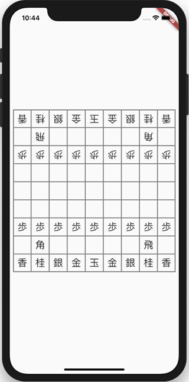
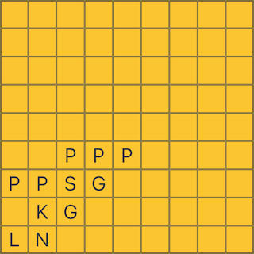
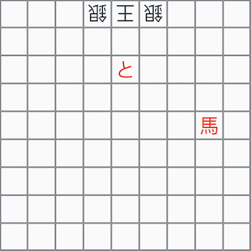

# flutter_shogi_board

A shogi board widget for Flutter. This widget can be used to render static game board positions, tsume problems or shogi castles.



Shogi (将棋) is a two-player strategy board game native to Japan, belonging to the same family as chess and xiangqi. 

## Getting Started

### Import the package

To import this package, simply add `flutter_shogi_board` as a dependency in `pubspec.yaml`

```yaml
dependencies:
  flutter:
    sdk: flutter
  flutter_shogi_board:
```

Note that this package requires dart >= 2.3.0.

### Example

```dart
import 'package:flutter/material.dart';
import 'package:flutter_shogi_board/flutter_shogi_board.dart';

void main() {
  runApp(
    MaterialApp(
      home: Scaffold(
        body: Padding(
          padding: const EdgeInsets.all(8.0),
          child: Center(
            child: ShogiBoard(
              boardPieces: ShogiUtils.initialBoard,
            ),
          ),
        ),
      ),
    ),
  );
}
```

For more information, see the Flutter app in the `example` directory.

## Game Board Parameters

The widget is designed to be used in portrait mode, and fills the board size to match it's parents width. The board pieces are rendered as text.

| Parameter            | Description                                                                               |
|:---------------------|:------------------------------------------------------------------------------------------|
| `boardPieces`        | A `List<BoardPiece>` to render on the shogi game board.                                   |
| `pieceColor`         | Optional. The standard piece color, defaults to black.                                    |
| `promotedPieceColor` | Optional. The promoted piece color, defaults to red.                                      |
| `cellColor`          | Optional. The board cell background color, defaults to transparent.                       |
| `borderColor`        | Optional. The board cell background color, defaults to gray.                              |
| `usesJapanese`       | Optional. Whether japanese characters or english letters are displayed, defaults to true. |

## Importing a Game Board

As the game board is presently static, a board position can be notated by `{PieceType}-{Row}{Column}`, i.e. `K-59`. If sente or gote aren't specified, then sente is chosen by default. Note that 11 is the top left board cell as per japanese notation.

```dart
final yagura = ['L-99', 'N-89', 'K-88', 'G-78', 'P-97', 'P-87', 'S-77', 'G-67', 'P-76', 'P-66', 'P-56'];

final boardPieces = ShogiUtils.stringArrayToBoardPiecesArray(yagura);
```

To import pieces for both players, use the notation `{Player}:{PieceType}-{Row}{Column}`.

```dart
final tsume1 = ['G:K-51', 'G:S-61', 'G:S-41', 'S:+P-53', 'S:+B-25'];
```

|                    |                    |
|:-------------------|:-------------------|
|  |  |


## Future Plans

This package grew out of my desired to visualize shogi castles in Flutter, and with no widget or even shogi package available, I decided to roll my own.

For the future I would like to utilize this widget not just for displaying static game boards, but also for tsume problems, thus user interaction may be considered. The models and enums may also be moved to their own package, if deemed necessary.

As the game board is static, the notation `G:K-51` is currently utilized to import game boards, however `KIF` may be more suitable for future versions:

```
1 ７六歩(77)
2 ３四歩(33)
3 ７五歩(76)
```

Finally, presently the numbers 1-9 and 一, 二, 三, 四, 五, 六, 七, 八, 九 are not displayed to mark cell positions, this is something that could be offered as an optional boolean defaulting to `true`.

## Raising Issues and Contributing

Please report bugs and issues, and raise feature requests on [GitHub](https://github.com/defuncart/flutter_shogi_board/issues).

To contribute, submit a PR with a detailed description and tests, if applicable.
