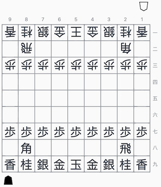

# flutter_shogi_board

A shogi board widget for Flutter. This widget can be used in conjunction with [*shogi*](https://pub.dev/packages/shogi) to render static game board positions, tsume problems or shogi castles.

<table>
  <tr>
    <td></td>
    <td></td>
  </tr>
</table>

As this package is still highly experimental, 0.0.x versioning is used. *shogi* is also in active development and similarly versioned.

## Getting Started

### Import the package

To import this package, simply add `flutter_shogi_board` as a dependency in `pubspec.yaml`

```yaml
dependencies:
  flutter:
    sdk: flutter
  flutter_shogi_board:
```

Note that this package requires dart >= 2.7.0.

### Example

```dart
import 'package:flutter/material.dart';
import 'package:flutter_shogi_board/flutter_shogi_board.dart';
import 'package:shogi/shogi.dart';

void main() {
  runApp(
    MaterialApp(
      home: Scaffold(
        body: Padding(
          padding: const EdgeInsets.all(8.0),
          child: Center(
            child: ShogiBoard(
              gameBoard: ShogiUtils.initialBoard,
            ),
          ),
        ),
      ),
    ),
  );
}
```

For more information, see the Flutter app in the `example` directory. This example is also hosted [online](http://defuncart.com/flutter_shogi_board/).

## Basic Usage

### ShogiGameBoard

This widget renders a shogi game board using a `GameBoard` and `ShogiBoardStyle`. Unless `style.maxSize` is set, it fills its maximum size to that of its parent. The board pieces are rendered as text.

| Parameter             | Description                                                                                |
|:----------------------|:-------------------------------------------------------------------------------------------|
| `gameBoard`           | A `GameBoard` to render.                                                                   |
| `style`               | Optional. A style to render the shogi board, defaults to constants listed below.           |
| `showPiecesInHand`    | Optional. Whether pieces in hand should be shown, defaults to true.                        |

### ShogiBoardStyle

A model used to paint a `ShogiBoard`.

| Parameter             | Description                                                                                |
|:----------------------|:-------------------------------------------------------------------------------------------|
| `maxSize`             | The maximum size of the board. Defaults to double.infinity.                                |
| `pieceColor`          | Optional. The standard piece color, defaults to black.                                     |
| `promotedPieceColor`  | Optional. The promoted piece color, defaults to red.                                       |
| `cellColor`           | Optional. The board cell background color, defaults to transparent.                        |
| `borderColor`         | Optional. The board cell background color, defaults to gray.                               |
| `usesJapanese`        | Optional. Whether japanese characters or english letters are displayed, defaults to true.  |
| `showCoordIndicators` | Optional. Whether board coordinate indicators should be shown, defaults to true.           |
| `coordIndicatorType`  | Optional. The type of coordinate indicators show, defaults to CoordIndicatorType.japanese. |

### DefaultShogiBoardStyle

The `ShogiBoardStyle` to apply to descendant `ShogiBoard` widgets without an explicit style.

```dart
DefaultShogiBoardStyle(
  style: ShogiBoardStyle(
    cellColor: BoardColors.brown,
  ),
  child: MaterialApp(
    ...
```

## Showcase

| Name                                                          | Description                                               |
| ------------------------------------------------------------- | --------------------------------------------------------- |
| [shogi_proverbs](https://github.com/defuncart/shogi_proverbs) | A mobile application containing various Shogi proverbs.   |
| [kifu_viewer](https://github.com/defuncart/kifu_viewer)       | An application to view Shogi games by loading Kifu files. |

## Future Plans

This package grew out of my desired to visualize shogi castles in Flutter, and with no game board widget or even a shogi engine available, I decided to roll my own.

For the future I would like to utilize this widget not just for displaying static game boards, but also for tsume problems, thus user interaction may be considered.

## Raising Issues and Contributing

Please report bugs and issues, and raise feature requests on [GitHub](https://github.com/defuncart/flutter_shogi_board/issues).

To contribute, submit a PR with a detailed description and tests, if applicable.
